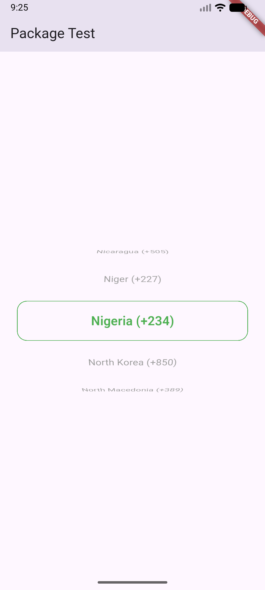
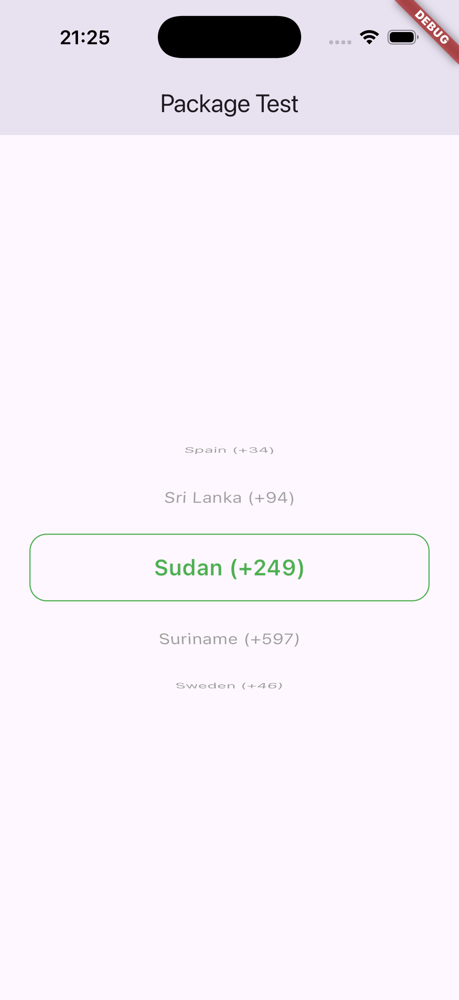

# countrydialselector

A lightweight and customizable Flutter package for selecting country phone dial codes using a smooth wheel-style picker.

Designed to be simple, flexible, and easy to integrate into any Flutter application.

---

## ✨ Features

- 🎡 Smooth wheel-style country selector  
- 🌍 Built-in list of common countries and dial codes  
- 🎯 Set an initial selected country  
- 🎨 Fully customizable colors (selected, unselected, border)  
- 🧩 Strongly typed API (`CountryData`)  
- 📦 Lightweight and package-friendly  
- 🔌 Easy to extend with custom country lists  

---

## 📸 Preview

| Android | iOS |
|--------|-----|
|  |  |

---

## 🚀 Installation

Add this to your `pubspec.yaml`:

```yaml
dependencies:
  countrydialselector: ^0.0.1
